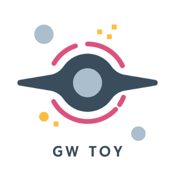

<p align="center">
  <a href="" rel="noopener">
 </a>
</p>

<h3 align="center">Gravitational Wave Toy</h3>

<div align="center">

[]()
[](https://github.com/astrojarred/gravitational_wave_toy/issues)
[](https://github.com/astrojarred/gravitational_wave_toy/pulls)
[](/LICENSE)

</div>

---

<p align="center"> The purpose of this is to simualte the possibility of detecting very-high-energy electromagnetic counterparts to gravitational wave events events. The package can also create heatmaps for observations of simulated gravitational wave events to determine under which circumstances the event could be detectable by a gamma-ray observatory.
</p>

## 📝 Table of Contents

- [Table of Contents](#-table-of-contents)
- [About](#-about)
- [Getting Started](#-getting-started)
- [Authors](#️-authors)
- [Instructions](#-instructions)
  - [GW Observations](#gw-observations)
  - [Plotting Heatmaps](#plotting-heatmaps)

## 🧐 About<a name = "about"></a>

An input GRB model and an instrument sensitivity curve specific to the desired observational conditions are provided as input. Given a delay from the onset of the event, the code uses a simple optimization algorithm to determine at which point in time (if at all) the source would be detectable by an instrument with the given sensitivity.

The purpose of this is to simualte the possibility of detecting very-high-energy electromagnetic counterparts to gravitational wave events events. The package can also create heatmaps for observations of simulated gravitational wave events to determine under which circumstances the event could be detectable by a gamma-ray observatory.

For more information, check out our [ICRC proceedings from 2021](https://pos.sissa.it/395/998/pdf).

## 🏁 Getting Started<a name = "getting_started"></a>

You need a gravitational wave event catalog. If you don't have this please contact the maintainers.

In addition, you need a python installation and the packages outlines in `pyproject.toml`. We recommend using `poetry` or `conda` to manage your python environment.

Note: dask is only necessary to read in the output data with the `gwplot` class.

## ✍️ Authors<a name = "authors"></a>

- [Jarred Green](https://github.com/astrojarred) (jgreen at mpp.mpg.de)
- Barbara Patricelli (barbara.patricelli at pi.infn.it)
- Antonio Stamerra (antonio.stamerra at inaf.it)
## 🧑‍🏫 Instructions<a name = "instructions"></a>
### GW Observations<a name = "instructions-gw-obs"></a>
**Methods:**
This code simulates observations of simulated gravitational wave events to determine under which circumstances the event could be detectable by a gamma-ray observatory. An input GRB model and an instrument sensitivity curve specific to the desired observational conditions are provided as input. Given a delay from the onset of the event, the code uses a simple optimization algorithm to determine at which point in time (if at all) the source would be detectable by an instrument with the given sensitivity.


**Note:** Details regarding the mathematics are provided in `math.md`

**Inputs:**
   - An instrument sensitivity file from `grbsens`
     - Newest version is v3 and can be found [here](CTA_sensitivity/grbsens_output_v3_Sep_2022/)
   - GW event models (currently compatible with O5 simulations)

**Output**
   - a dictionary object containing detection information and parameters of the event itself (extracted from the model)

**Example:**
```python
from gravitational_wave_toy import gwobserve

# import the sensitivity
# interpolation of the sensitivity curve will be done here
sens = gwobserve.Sensitivity(
    "/path/to/sensitivity/file/grbsens-5.0sigma_t1s-t16384s_irf.txt",
    min_energy=0.3,     # generally determined by the energy range of the IRFs
    max_energy=10000,
)

# import a GRB file
# interpolation of the spectra are performed here
grb = GW.GRB("../GammaCatalog_O5/cat05_runID.fits")

# simulate observations
res = grb.observe(
    sensitivity=sens, 
    start_time=3600,     # starting delay in seconds
    target_precision=0.1  # numerical precision 
    )

# output
print(res)
> {
>   'filepath': '../GammaCatalog_O5/catO5_100.fits',
>   'min_energy': 0.3,
>   'max_energy': 10000,
>   'seen': True,
>   'obs_time': 15,
>   'start_time': 3600,
>   'end_time': 3615,
>   'error_message': '',
>   'long': 6.1,
>   'lat': -10.5,
>   'eiso': 4.37e+48,
>   'dist': 124000.0,
>   'angle': 34.412
> }


```

### Plotting Heatmaps<a name = "instructions-plotting"></a>

**Methods:**
This code creates heatmaps from the results of the `gwobserve` method which shows the ideal exposures observation times for different instruments, sensitivities, and subsets of GW events. 

**Inputs:**
   - An output file from `gwobserve` in csv or parquet format
   - Optional: how you would like to filter the data before creating the plots

**Output**
   - heatmaps of the results (either interactive or exported directly as an image)

**Example:**
```python
# import the data
from gravitational_wave_toy import gwplot
gws = gwplot.GWData("/path/to/data/file.parquet")  # or CSV

gws.set_filters(
   ("config", "==", "alpha"),
   ("site", "==", "south"),
   ("ebl", "==", True),
)

ax = gws.plot(
   output_file="heatmap.png",
   title="CTA South, alpha configuration, with EBL",
   min_value=0,
   max_value=1,
)
```

Other important options to `gws.plot` include:
   - `intput_file` (str): The path to the output file.
   - `annotate` (bool): Whether or not to annotate the heatmap.
   - `x_tick_labels` (list): The labels for the x-axis ticks.
   - `y_tick_labels` (list): The labels for the y-axis ticks.
   - `min_value` (float): The minimum value for the color scale.
   - `max_value` (float): The maximum value for the color scale.
   - `color_scheme` (str): The name of the color scheme to use for the heatmap.
   - `color_scale` (str): The type of color scale to use for the heatmap.
   - `as_percent` (bool): Whether or not to display the results as percentages.
   - `filetype` (str): The type of file to save the plot as.
   - `title` (str): The title for the plot.
   - `subtitle` (str): The subtitle for the plot.
   - `n_labels` (int): The number of labels to display on the axes.
   - `show_only` (bool): Whether or not to show the plot instead of saving it.
   - `return_ax` (bool): Whether or not to return the axis object.
